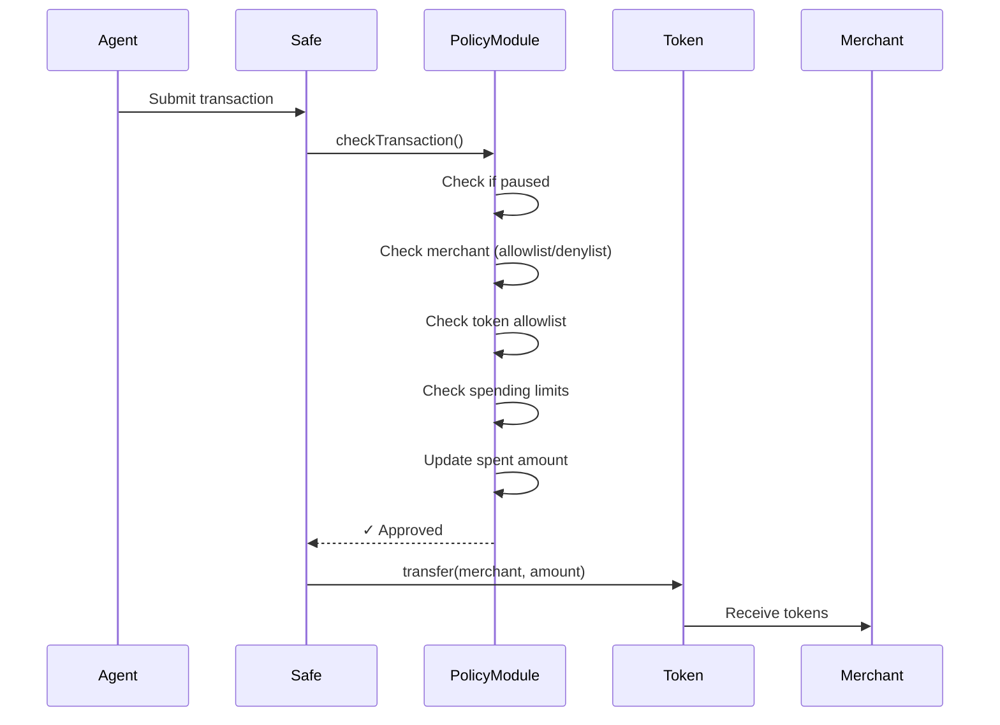

Sardis uses audited smart contracts to enforce spending policies and enable gasless transactions for AI agent wallets.

## Overview

Sardis smart contracts provide:

1. **Policy Enforcement**: On-chain spending limits, merchant allowlists, and token restrictions
2. **Gasless Transactions**: ERC-4337 paymaster for sponsored transactions
3. **Safe Integration**: Modular architecture compatible with Safe (formerly Gnosis Safe)

**Contracts Location**: `contracts/src/`

---

## SardisPolicyModule

**Purpose**: Safe module that enforces spending policies for AI agent wallets before every transaction.

**File**: `contracts/src/SardisPolicyModule.sol`

**Architecture**: Modular guard that integrates with Safe Smart Accounts (>$100B TVL, battle-tested security).

### Core Features

#### 1. Spending Limits

**Per-Transaction Limits**:
```solidity
struct WalletPolicy {
    uint256 limitPerTx;           // Normal per-tx limit
    uint256 dailyLimit;           // Normal daily limit
    uint256 coSignLimitPerTx;     // Co-signed per-tx (10x default)
    uint256 coSignDailyLimit;     // Co-signed daily (10x default)
    // ...
}
```

**Limit Checking** (`SardisPolicyModule.sol:334-341`):
```solidity
function _checkLimits(address safe, uint256 amount) internal view {
    WalletPolicy storage policy = policies[safe];
    require(amount <= policy.limitPerTx, "Exceeds per-tx limit");

    uint256 today = block.timestamp / 1 days;
    uint256 todaySpent = today > lastResetDay[safe] ? 0 : spentToday[safe];
    require(todaySpent + amount <= policy.dailyLimit, "Exceeds daily limit");
}
```

#### 2. Co-Sign Mode

Elevated limits when both agent + Sardis approve:

```solidity
// contracts/src/SardisPolicyModule.sol:179-219
function checkCoSignedTransaction(
    address safe,
    address to,
    uint256 value,
    bytes calldata data
) external onlySardis walletInitialized(safe) {
    // Uses coSignLimitPerTx and coSignDailyLimit (10x normal)
    _checkCoSignLimits(safe, amount);
}
```

**Default Limits**:
- Normal: Configured at initialization
- Co-Sign: 10x normal limits
- Daily Reset: Automatic at midnight UTC

#### 3. Merchant Controls

**Allowlist Mode**:
```solidity
// contracts/src/SardisPolicyModule.sol:259-263
function allowMerchant(address safe, address merchant) 
    external onlySardis {
    allowedMerchants[safe][merchant] = true;
    deniedMerchants[safe][merchant] = false;
}
```

**Denylist** (overrides allowlist):
```solidity
function denyMerchant(address safe, address merchant) 
    external onlySardis {
    deniedMerchants[safe][merchant] = true;
    allowedMerchants[safe][merchant] = false;
}
```

**Enforcement** (`SardisPolicyModule.sol:326-332`):
```solidity
function _checkMerchant(address safe, address merchant) internal view {
    WalletPolicy storage policy = policies[safe];
    if (policy.useAllowlist) {
        require(allowedMerchants[safe][merchant], "Merchant not allowed");
    }
    require(!deniedMerchants[safe][merchant], "Merchant denied");
}
```

#### 4. Token Allowlist

Stablecoin-only enforcement by default:

```solidity
// contracts/src/SardisPolicyModule.sol:156-160
if (policy.enforceTokenAllowlist) {
    require(allowedTokens[safe][to], "Token not allowed");
}
```

**Token Management**:
```solidity
function allowToken(address safe, address token) external onlySardis {
    require(token != address(0), "Invalid token");
    allowedTokens[safe][token] = true;
    emit TokenAllowed(safe, token);
}

function removeToken(address safe, address token) external onlySardis {
    allowedTokens[safe][token] = false;
    emit TokenRemoved(safe, token);
}
```

#### 5. Pause Control

Emergency pause for individual wallets:

```solidity
// contracts/src/SardisPolicyModule.sol:242-249
function pause(address safe) external onlySardis {
    policies[safe].paused = true;
    emit WalletPaused(safe);
}

function unpause(address safe) external onlySardis {
    policies[safe].paused = false;
    emit WalletUnpaused(safe);
}
```

### Transaction Flow



### Initialization

```solidity
// contracts/src/SardisPolicyModule.sol:103-121
function initializeWallet(
    address safe,
    uint256 _limitPerTx,
    uint256 _dailyLimit
) external onlySardis {
    require(!policies[safe].initialized, "Already initialized");

    policies[safe] = WalletPolicy({
        limitPerTx: _limitPerTx,
        dailyLimit: _dailyLimit,
        coSignLimitPerTx: _limitPerTx * 10,
        coSignDailyLimit: _dailyLimit * 10,
        useAllowlist: false,
        enforceTokenAllowlist: true,  // Stablecoin-only by default
        paused: false,
        initialized: true
    });
}
```

### View Functions

```solidity
// Check remaining daily limit
function getRemainingDailyLimit(address safe) 
    external view returns (uint256) {
    uint256 today = block.timestamp / 1 days;
    if (today > lastResetDay[safe]) {
        return policy.dailyLimit;  // New day, full limit
    }
    return policy.dailyLimit - spentToday[safe];
}

// Check if token is allowed
function isTokenAllowed(address safe, address token) 
    external view returns (bool) {
    if (!policies[safe].enforceTokenAllowlist) return true;
    return allowedTokens[safe][token];
}

// Get full policy configuration
function getPolicy(address safe) 
    external view returns (WalletPolicy memory);
```

### Events

```solidity
event WalletInitialized(address indexed safe, uint256 limitPerTx, uint256 dailyLimit);
event LimitsUpdated(address indexed safe, uint256 limitPerTx, uint256 dailyLimit, ...);
event WalletPaused(address indexed safe);
event WalletUnpaused(address indexed safe);
event MerchantAllowed(address indexed safe, address indexed merchant);
event MerchantDenied(address indexed safe, address indexed merchant);
event TokenAllowed(address indexed safe, address indexed token);
event TransactionChecked(address indexed safe, address indexed to, uint256 value);
```

---

## SardisVerifyingPaymaster

**Status**: DEPRECATED - Use Circle Paymaster instead

**Circle Paymaster Address** (all chains): `0x0578cFB241215b77442a541325d6A4E6dFE700Ec`

**File**: `contracts/src/SardisVerifyingPaymaster.sol` (reference only)

### Why Deprecated?

Circle's permissionless paymaster provides:
- No deployment required
- Cross-chain support (Base, Ethereum, Polygon, Arbitrum, Optimism)
- Automatic USDC refills
- Production-grade reliability

### Original Architecture

**Purpose**: ERC-4337 paymaster with wallet allowlist and sponsor caps.

**Key Features**:

#### 1. Wallet Allowlist

```solidity
// contracts/src/SardisVerifyingPaymaster.sol:70-73
function setWalletAllowed(address wallet, bool allowed) 
    external onlyOwner {
    allowedWallets[wallet] = allowed;
}
```

#### 2. Sponsorship Caps

```solidity
struct Caps {
    uint256 maxSponsoredCostPerOp;  // Max cost per operation
    uint256 dailySponsorCap;        // Total daily cap
    uint256 spentToday;             // Amount spent today
    uint256 lastSpendDay;           // Last spending day
}
```

**Validation** (`SardisVerifyingPaymaster.sol:103-113`):
```solidity
function validatePaymasterUserOp(...) external override {
    if (!allowedWallets[userOp.sender]) 
        revert WalletNotAllowed(userOp.sender);
    
    if (maxCost > maxSponsoredCostPerOp) 
        revert CostLimitExceeded(maxCost, maxSponsoredCostPerOp);
    
    uint256 remaining = dailySponsorCap - spentToday;
    if (maxCost > remaining) 
        revert DailyCapExceeded(maxCost, remaining);
}
```

#### 3. Verifier Signature

Optional off-chain approval:

```solidity
// paymasterData format: abi.encode(address token, bytes signature)
if (verifier != address(0)) {
    bytes32 digest = keccak256(abi.encodePacked(
        address(this), block.chainid, 
        userOp.sender, token, maxCost, userOpHash
    ));
    if (digest.recover(sig) != verifier) 
        revert InvalidVerifierSignature();
}
```

### Migration to Circle Paymaster

Sardis now uses Circle's production paymaster:

```python
# packages/sardis-chain/src/sardis_chain/erc4337/paymaster_client.py
CIRCLE_PAYMASTER_ADDRESS = "0x0578cFB241215b77442a541325d6A4E6dFE700Ec"

class PaymasterClient:
    async def get_paymaster_data(self, user_op: UserOperation) -> bytes:
        # Request sponsorship from Circle Paymaster API
        response = await self._request_sponsorship(user_op)
        return response.paymaster_and_data
```

---

## Contract Interactions

### From Python SDK

```python
from sardis_chain.safe_account import SafeAccount
from sardis_chain.erc4337 import UserOperation

# Initialize Safe with policy module
safe = SafeAccount(
    address="0x...",
    chain="base",
    policy_module="0x..."  # SardisPolicyModule address
)

# Submit transaction (policy checked on-chain)
tx_hash = await safe.send_transaction(
    to="0xMerchantAddress",
    value=0,
    data=usdc_transfer_data,
)

# For gasless transactions (ERC-4337)
user_op = await safe.create_user_operation(
    to="0xMerchantAddress",
    data=usdc_transfer_data,
)

# Add Circle Paymaster sponsorship
user_op_with_paymaster = await paymaster_client.sponsor(user_op)

# Submit to bundler
tx_hash = await bundler_client.send_user_operation(user_op_with_paymaster)
```

### Policy Management API

```python
# Update wallet limits
await policy_module.set_limits(
    safe=wallet_address,
    limit_per_tx=1000_000_000,  # $1000 per tx
    daily_limit=5000_000_000,   # $5000 per day
    co_sign_limit_per_tx=10000_000_000,  # $10k with co-sign
    co_sign_daily_limit=50000_000_000,   # $50k with co-sign
)

# Add merchant to allowlist
await policy_module.allow_merchant(
    safe=wallet_address,
    merchant="0xMerchantAddress"
)

# Add token to allowlist
await policy_module.allow_token(
    safe=wallet_address,
    token="0x833589fCD6eDb6E08f4c7C32D4f71b54bdA02913"  # USDC on Base
)

# Pause wallet in emergency
await policy_module.pause(wallet_address)
```

---

## Deployment Addresses

### SardisPolicyModule

| Chain | Address | Deployment |
|-------|---------|------------|
| Base | *Not yet deployed* | Pending mainnet deployment |
| Base Sepolia | *Not yet deployed* | Testnet |
| Ethereum | *Not yet deployed* | Pending mainnet deployment |
| Polygon | *Not yet deployed* | Pending mainnet deployment |

**Note**: Sardis currently uses simulated chain mode in development. Mainnet deployments coming Q2 2026.

### Circle Paymaster (Production)

**Address** (all chains): `0x0578cFB241215b77442a541325d6A4E6dFE700Ec`

| Chain | Status |
|-------|--------|
| Base | ✅ Live |
| Ethereum | ✅ Live |
| Polygon | ✅ Live |
| Arbitrum | ✅ Live |
| Optimism | ✅ Live |

**Documentation**: https://developers.circle.com/w3s/docs/paymaster

---

## Security Considerations

### SardisPolicyModule

**Audited**: Compatible with Safe's audited module system

**Security Features**:
1. **Fail-Closed**: Revert on policy violation (no bypass possible)
2. **Daily Limits**: Automatic reset at midnight UTC
3. **Merchant Denylist**: Blacklist overrides allowlist
4. **Token Enforcement**: Stablecoin-only by default
5. **Pause Control**: Emergency stop per wallet

**Access Control**:
- Only Sardis platform address can modify policies
- Wallet owners cannot bypass policy checks
- Co-sign requires Sardis signature

### Best Practices

```solidity
// contracts/src/SardisPolicyModule.sol:78-81
modifier onlySardis() {
    require(msg.sender == sardis, "Only Sardis");
    _;
}
```

**Immutable EntryPoint**:
```solidity
IEntryPoint public immutable entryPoint;
```

**Reentrancy Protection**: Uses OpenZeppelin's battle-tested patterns

---

## Gas Costs

### SardisPolicyModule

| Operation | Gas Cost | Notes |
|-----------|----------|-------|
| Initialize Wallet | ~100k | One-time setup |
| Check Transaction | ~30k | Per transfer |
| Update Limits | ~50k | Admin operation |
| Allow Merchant | ~45k | Admin operation |
| Allow Token | ~45k | Admin operation |

**Optimization**: Policy checks cached in storage for O(1) lookups.

### Gasless Transactions (Circle Paymaster)

**Sponsored Operations**:
- User pays: $0 (fully sponsored)
- Sardis/Circle pays: ~$0.01 on Base, ~$0.50 on Ethereum

**ERC-4337 Overhead**: +50k gas vs. direct transfer (~65k → ~115k total)

**Cost Comparison** (USDC transfer on Base):
- Direct: ~$0.0001 (user pays gas)
- Gasless: ~$0.0002 (Sardis pays gas)

---

## Contract Source Code

### SardisPolicyModule.sol

**Full implementation**: `contracts/src/SardisPolicyModule.sol` (362 lines)

**Key sections**:
- State Variables: Lines 23-43
- Wallet Initialization: Lines 96-121
- Transaction Guard: Lines 124-176
- Co-Sign Mode: Lines 179-219
- Policy Management: Lines 222-293
- Internal Helpers: Lines 325-360

### SardisVerifyingPaymaster.sol

**Reference implementation**: `contracts/src/SardisVerifyingPaymaster.sol` (160 lines)

**Deprecated**: Use Circle Paymaster instead

---

## Testing

### Foundry Tests

```bash
cd contracts
forge test --match-contract SardisPolicyModuleTest
```

**Test Coverage**:
- Spending limit enforcement
- Daily limit reset
- Merchant allowlist/denylist
- Token allowlist
- Co-sign mode
- Pause/unpause
- ERC-20 detection (transfer/approve)

### Integration Tests

```python
# tests/test_policy_module.py
import pytest
from sardis_chain.safe_account import SafeAccount

@pytest.mark.asyncio
async def test_policy_enforcement():
    safe = SafeAccount(address="0x...", chain="base_sepolia")
    
    # Should succeed: within limits
    tx1 = await safe.transfer_usdc("0xMerchant", 100)
    assert tx1.status == "success"
    
    # Should fail: exceeds per-tx limit
    with pytest.raises(TransactionReverted, match="Exceeds per-tx limit"):
        await safe.transfer_usdc("0xMerchant", 10_000)
```

---

## Next Steps

<CardGroup cols={2}>
  <Card title="Gas Optimization" icon="gauge-high" href="/blockchain/gas-optimization">
    Minimize transaction costs with smart routing
  </Card>
  <Card title="Supported Chains" icon="link" href="/blockchain/supported-chains">
    Chain configurations and RPC endpoints
  </Card>
  <Card title="Supported Tokens" icon="coins" href="/blockchain/supported-tokens">
    Token addresses and allowlist management
  </Card>
</CardGroup>
