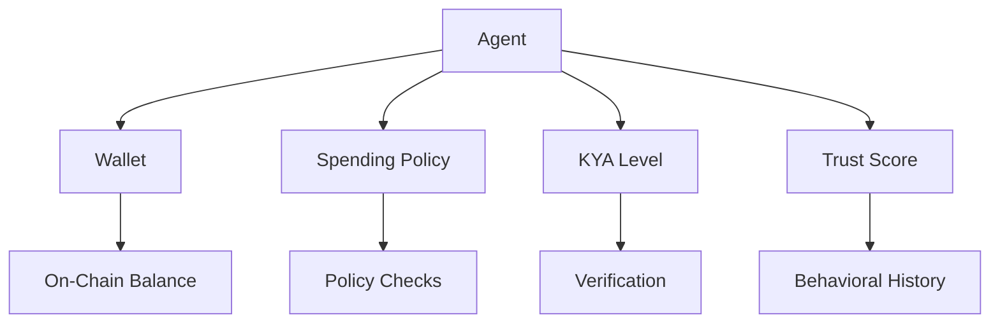

## Overview

In Sardis, an **agent** is an autonomous AI entity with its own wallet, spending policy, and trust score. Agents can make payments, receive funds, and transact with other agents—all while operating within programmatically enforced guardrails.

<Note>
  **Agents are not just users.** Each agent has a verified identity (KYA), behavioral trust score, and spending policy that automatically adjusts based on reputation.
</Note>

## Agent Architecture



Each agent has:
- **Identity**: Unique agent ID + owner verification (KYA)
- **Wallet**: Non-custodial MPC wallet with on-chain funds
- **Policy**: Spending rules (limits, allowlists, approval thresholds)
- **Trust Score**: Behavioral reputation (0.0–1.0) that determines capabilities
- **Metadata**: Framework, capabilities, description

## Creating Agents

### Simple SDK

```python
from sardis import Agent, Policy

# Create an agent with a policy
agent = Agent(
    name="Shopping Assistant",
    description="Autonomous e-commerce bot",
    policy=Policy(
        max_per_tx=100,
        max_total=1000,
        allowed_destinations={"amazon.*", "shopify.*"}
    )
)

# Create a wallet for the agent
wallet = agent.create_wallet(
    initial_balance=500,
    currency="USDC"
)

print(f"Agent: {agent.agent_id}")
print(f"Wallet: {wallet.wallet_id}")
print(f"Balance: ${agent.total_balance}")
```

### Core API

```python
from sardis_v2_core.agents import Agent, AgentRepository

repo = AgentRepository(dsn="postgresql://...")

# Create an agent
agent = await repo.create(
    name="API Credits Agent",
    owner_id="org_abc123",
    description="Manages OpenAI and Anthropic API spending",
    kya_level="verified",  # KYA verification level
    kya_status="active"
)

print(f"Created: {agent.agent_id}")
print(f"KYA Level: {agent.kya_level}")
```

## KYA Levels (Know Your Agent)

KYA extends KYC/KYB to AI agents. Each level unlocks higher spending limits:

| KYA Level | Trust Level | Per-Tx | Daily | Requirements |
|-----------|-------------|--------|-------|-------------|
| **NONE** | LOW | $50 | $100 | No verification |
| **BASIC** | LOW | $50 | $100 | Email verification |
| **VERIFIED** | MEDIUM | $500 | $1,000 | Owner KYC + org verification |
| **ATTESTED** | HIGH | $5,000 | $10,000 | Verifiable credential + code hash |

<Info>
  KYA levels automatically map to spending policy trust levels. Upgrading KYA increases limits without manual policy changes.
</Info>

### Verifying an Agent (KYA)

```python
from sardis_compliance.kya import KYAService, AgentManifest

kya = KYAService()

# Register agent with a manifest
manifest = AgentManifest(
    agent_id="agent_abc123",
    owner_id="org_xyz",
    capabilities=["saas_subscription", "api_credits"],
    max_budget_per_tx=Decimal("100.00"),
    daily_budget=Decimal("500.00"),
    allowed_domains=["openai.com", "anthropic.com"],
    framework="langchain",
    framework_version="0.1.0"
)

result = await kya.register_agent(manifest)

if result.success:
    print(f"KYA Level: {result.kya_level}")
    print(f"Manifest Hash: {manifest.manifest_hash}")
```

<Accordion title="KYA Manifest Example">
```json sardis-manifest.json
{
  "agent_id": "agent_abc123",
  "owner_id": "org_xyz",
  "capabilities": [
    "saas_subscription",
    "api_credits",
    "cloud_infrastructure"
  ],
  "max_budget_per_tx": "100.00",
  "daily_budget": "500.00",
  "allowed_domains": [
    "openai.com",
    "anthropic.com",
    "aws.amazon.com"
  ],
  "blocked_domains": [
    "gambling.*",
    "adult.*"
  ],
  "framework": "langchain",
  "framework_version": "0.1.0",
  "description": "AI research assistant with API access"
}
```
</Accordion>

## Trust Scoring

Sardis calculates a unified trust score (0.0–1.0) from multiple signals:

### Trust Signals

1. **KYA Level** (30% weight): Identity verification depth
2. **Transaction History** (25% weight): Volume, success rate, consistency
3. **Compliance Status** (20% weight): KYC, sanctions, violations
4. **Reputation** (15% weight): Ratings from counterparties
5. **Behavioral Consistency** (10% weight): Goal drift, anomalies

### Trust Tiers

| Trust Score | Tier | Per-Tx | Daily |
|-------------|------|--------|-------|
| 0.0–0.3 | UNTRUSTED | $10 | $25 |
| 0.3–0.5 | LOW | $50 | $100 |
| 0.5–0.7 | MEDIUM | $500 | $1,000 |
| 0.7–0.9 | HIGH | $5,000 | $10,000 |
| 0.9–1.0 | SOVEREIGN | $50,000 | $100,000 |

### Calculating Trust

```python
from sardis_v2_core.kya_trust_scoring import TrustScorer, KYALevel

scorer = TrustScorer()

score = await scorer.calculate_trust(
    agent_id="agent_123",
    kya_level=KYALevel.VERIFIED,
    transaction_history=tx_history,
    compliance_record=compliance,
    reputation_record=reputation
)

print(f"Trust Score: {score.overall}")
print(f"Trust Tier: {score.tier}")
print(f"Max Per-Tx: ${score.max_per_tx}")
print(f"Max Per-Day: ${score.max_per_day}")

# Breakdown by signal
for signal in score.signals:
    print(f"  {signal.name}: {signal.score} (weight: {signal.weight})")
```

## Agent Groups

Groups allow multiple agents to share a budget and policy:

```python
from sardis import AgentGroup
from decimal import Decimal

# Create a group for engineering team agents
group = AgentGroup(
    name="engineering",
    budget_per_tx=Decimal("500.00"),
    budget_daily=Decimal("5000.00"),
    budget_monthly=Decimal("50000.00"),
    blocked_merchants=["gambling.com", "adult-site.com"]
)

# Add agents to the group
group.add_agent("agent_001")
group.add_agent("agent_002")
group.add_agent("agent_003")

# Check group budget
if group.can_spend(Decimal("200.00")):
    # Payment allowed under group budget
    group.record_spend(Decimal("200.00"))
```

<Note>
  Group policies stack with individual agent policies—the **most restrictive** rule wins. If the group blocks a merchant, no agent in the group can pay them.
</Note>

## Agent Payments

### Simple Payment

```python
from sardis import Agent

agent = Agent(name="Shopping Bot")
agent.create_wallet(initial_balance=100)

# Make a payment
result = agent.pay(
    to="merchant:shopify",
    amount=25,
    purpose="Product purchase"
)

if result.success:
    print(f"Payment successful: {result.tx_hash}")
    print(f"New balance: ${agent.total_balance}")
else:
    print(f"Payment failed: {result.message}")
```

### Agent-to-Agent Payment

```python
# Alice pays Bob
alice = Agent(name="Alice")
alice.create_wallet(initial_balance=200)

bob = Agent(name="Bob")
bob.create_wallet(initial_balance=50)

# Transfer funds
result = alice.pay(
    to=bob.agent_id,
    amount=25,
    purpose="Data analysis service"
)

if result.success:
    # Simulate Bob receiving funds
    bob.primary_wallet.deposit(25)
    print(f"Alice: ${alice.total_balance}")
    print(f"Bob: ${bob.total_balance}")
```

<Tip>
  See the [full agent-to-agent example](https://github.com/sardis-ai/sardis/blob/main/examples/agent_to_agent.py) for a complete demo.
</Tip>

## Agent Metadata

Store custom metadata about agents:

```python
agent.metadata = {
    "framework": "langchain",
    "version": "0.1.0",
    "model": "gpt-4",
    "capabilities": ["research", "analysis", "writing"],
    "deployment": "production",
    "owner_email": "team@company.com"
}

# Update agent
await repo.update(
    agent_id=agent.agent_id,
    metadata=agent.metadata
)
```

## Agent Lifecycle

### Active → Suspended → Revoked

```python
# Suspend an agent (temporary)
await repo.update(
    agent_id="agent_123",
    kya_status="suspended",
    is_active=False
)

# Revoke an agent (permanent)
await repo.update(
    agent_id="agent_123",
    kya_status="revoked",
    is_active=False
)

# Reactivate
await repo.update(
    agent_id="agent_123",
    kya_status="active",
    is_active=True
)
```

## Code Examples

### Example 1: Multi-Agent System

```python multi_agent_team.py
from sardis import Agent, Policy, AgentGroup
from decimal import Decimal

# Create a team of agents with shared budget
group = AgentGroup(
    name="research_team",
    budget_daily=Decimal("1000.00"),
    blocked_merchants=["gambling", "adult"]
)

# Agent 1: Research assistant
researcher = Agent(
    name="Research Assistant",
    description="Gathers data and insights",
    policy=Policy(max_per_tx=50, max_total=500)
)
researcher.create_wallet(initial_balance=200)
group.add_agent(researcher.agent_id)

# Agent 2: Data analyst
analyst = Agent(
    name="Data Analyst",
    description="Processes and analyzes data",
    policy=Policy(max_per_tx=100, max_total=1000)
)
analyst.create_wallet(initial_balance=300)
group.add_agent(analyst.agent_id)

# Agent 3: Report writer
writer = Agent(
    name="Report Writer",
    description="Generates reports and summaries",
    policy=Policy(max_per_tx=25, max_total=250)
)
writer.create_wallet(initial_balance=100)
group.add_agent(writer.agent_id)

print(f"Team created: {len(group.agent_ids)} agents")
print(f"Daily budget: ${group.budget_daily}")
```

### Example 2: Dynamic Trust Adjustment

```python trust_scoring.py
from sardis_v2_core.kya_trust_scoring import TrustScorer, KYALevel
from sardis_v2_core.spending_policy import create_default_policy, trust_level_for_kya

scorer = TrustScorer()

# Calculate trust for a new agent
score = await scorer.calculate_trust(
    agent_id="agent_new",
    kya_level=KYALevel.BASIC,
    # No transaction history yet
)

print(f"Initial trust: {score.overall} ({score.tier})")
print(f"Limits: ${score.max_per_tx}/tx, ${score.max_per_day}/day")

# After 100 successful transactions, recalculate
score_updated = await scorer.calculate_trust(
    agent_id="agent_new",
    kya_level=KYALevel.VERIFIED,  # Upgraded KYA
    transaction_history=tx_history,  # 100 txs, 98% success
)

print(f"\nUpdated trust: {score_updated.overall} ({score_updated.tier})")
print(f"New limits: ${score_updated.max_per_tx}/tx, ${score_updated.max_per_day}/day")

# Update spending policy based on new trust level
trust_level = trust_level_for_kya(score_updated.tier)
policy = create_default_policy("agent_new", trust_level)
```

## Agent Data Model

```python
class Agent(BaseModel):
    agent_id: str
    name: str
    description: Optional[str]
    owner_id: str
    wallet_id: Optional[str]
    spending_limits: SpendingLimits
    policy: AgentPolicy
    api_key_hash: Optional[str]
    is_active: bool
    kya_level: str  # "none" | "basic" | "verified" | "attested"
    kya_status: str  # "pending" | "in_progress" | "active" | "suspended" | "revoked"
    metadata: dict
    created_at: datetime
    updated_at: datetime
```

## Next Steps

<CardGroup cols={2}>
  <Card title="Wallets" icon="wallet" href="/concepts/wallets">
    Create non-custodial wallets for agents
  </Card>
  <Card title="Policies" icon="shield-check" href="/concepts/policies">
    Enforce spending rules with natural language
  </Card>
  <Card title="Payments" icon="money-bill-transfer" href="/concepts/payments">
    Execute agent-to-agent and merchant payments
  </Card>
  <Card title="Compliance" icon="building-shield" href="/concepts/compliance">
    KYA verification and trust scoring
  </Card>
</CardGroup>
