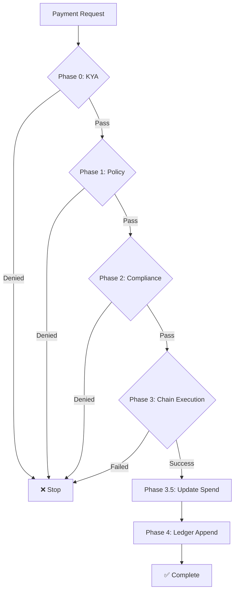

## Overview

Every payment in Sardis flows through a **multi-phase orchestrator** that enforces policies, compliance checks, and blockchain execution in a strict sequence. If any phase fails, the payment is denied and no funds move.

<Note>
  **Policy-first architecture:** Policy checks run before compliance, before gas estimation, before any blockchain interaction. This fail-fast approach prevents wasted resources on transactions that would be denied.
</Note>

## Payment Execution Pipeline



### Phase Breakdown

<Steps>
  <Step title="Phase 0: KYA Verification">
    - Check agent's KYA level (NONE/BASIC/VERIFIED/ATTESTED)
    - Verify agent liveness (heartbeat not stale)
    - Optionally verify code hash attestation
    - **If denied:** Raise `KYAViolationError`, STOP
  </Step>

  <Step title="Phase 1: Policy Validation">
    - Fetch the agent's `SpendingPolicy`
    - Run 10-check pipeline (amount, limits, merchants, drift, etc.)
    - Check group policy if agent belongs to a group
    - **If denied:** Raise `PolicyViolationError`, STOP
    - **If `requires_approval`:** Block (fail-closed)
  </Step>

  <Step title="Phase 2: Compliance Check">
    - KYC verification (Persona)
    - Sanctions screening (Elliptic)
    - AML risk scoring
    - **If denied:** Raise `ComplianceViolationError`, STOP
  </Step>

  <Step title="Phase 3: Chain Execution">
    - Build and sign transaction via MPC
    - Submit to blockchain (Base, Polygon, Ethereum, etc.)
    - Wait for confirmation
    - **If failed:** Raise `ChainExecutionError`, STOP
  </Step>

  <Step title="Phase 3.5: Policy State Update">
    - Record spend in database (atomic)
    - Update cumulative totals for future policy checks
    - Uses `SELECT FOR UPDATE` to prevent race conditions
  </Step>

  <Step title="Phase 4: Ledger Append">
    - Write to append-only audit ledger
    - If failed: Queue for reconciliation (payment already succeeded on-chain)
  </Step>
</Steps>

## Payment Types

### On-Chain Payments

Direct blockchain transfers using stablecoins:

```python
from sardis import Agent

agent = Agent(name="Shopping Bot")
agent.create_wallet(initial_balance=100)

# Pay on-chain address
result = agent.pay(
    to="0x742d35Cc6634C0532925a3b844Bc9e7595f0bEb",
    amount=25,
    purpose="Purchase from merchant"
)

if result.success:
    print(f"Transaction hash: {result.tx_hash}")
    print(f"Chain: {result.chain}")
    print(f"Block: {result.block_number}")
```

### Agent-to-Agent Payments

Transactions between two AI agents:

```python
from sardis import Agent

# Create two agents
alice = Agent(name="Alice")
alice.create_wallet(initial_balance=200)

bob = Agent(name="Bob")
bob.create_wallet(initial_balance=50)

# Alice pays Bob
result = alice.pay(
    to=bob.agent_id,
    amount=25,
    purpose="Data analysis service"
)

if result.success:
    # Simulate Bob receiving funds
    bob.primary_wallet.deposit(25)
    print(f"Alice balance: ${alice.total_balance}")
    print(f"Bob balance: ${bob.total_balance}")
```

<Tip>
  See the [complete agent-to-agent example](https://github.com/sardis-ai/sardis/blob/main/examples/agent_to_agent.py) for a full demo.
</Tip>

### Fiat Payments (Virtual Cards)

Pay merchants using virtual debit cards via Lithic:

```python
from sardis_v2_core import Wallet, VirtualCard

wallet = Wallet.new(agent_id="agent_123")

# Attach virtual card
wallet.virtual_card = VirtualCard(
    card_id="card_abc",
    last_four="4242",
    network="VISA"
)

# Pay with card
result = await wallet.pay_with_card(
    merchant="stripe.com",
    amount=Decimal("25.00")
)
```

## Transaction Lifecycle

### 1. Initiate Payment

```python
from sardis import Agent, Policy

agent = Agent(
    name="API Agent",
    policy=Policy(
        max_per_tx=100,
        allowed_destinations={"openai.*", "anthropic.*"}
    )
)
agent.create_wallet(initial_balance=500)

result = agent.pay(
    to="openai.com",
    amount=25,
    purpose="GPT-4 API credits"
)
```

### 2. Policy Check

The payment request goes through the 10-check pipeline:

```python
# Internal: Policy evaluation (simplified)
approved, reason = await policy.evaluate(
    wallet=wallet,
    amount=Decimal("25.00"),
    fee=Decimal("0.50"),
    chain="base",
    token=TokenType.USDC,
    merchant_id="openai.com",
    scope=SpendingScope.DIGITAL,
    rpc_client=rpc_client,
    policy_store=policy_store
)

if not approved:
    raise PolicyViolationError(reason)
```

### 3. Compliance Check

```python
from sardis_compliance import ComplianceService

compliance = ComplianceService()

# Check sanctions and KYC
check = await compliance.check_transaction(
    agent_id="agent_123",
    destination="openai.com",
    amount=Decimal("25.00")
)

if not check.approved:
    raise ComplianceViolationError(check.reason)
```

### 4. Chain Execution

```python
from sardis_chain import ChainExecutor

executor = ChainExecutor(chain="base")

# Sign and submit transaction
tx_hash = await executor.execute(
    from_wallet=wallet,
    to_address="0x...",
    amount=Decimal("25.00"),
    token=TokenType.USDC,
    mpc_signer=signer
)

print(f"Transaction submitted: {tx_hash}")

# Wait for confirmation
receipt = await executor.wait_for_confirmation(tx_hash)
print(f"Confirmed in block: {receipt.block_number}")
```

### 5. Record Spend

```python
# Update policy state (atomic)
await policy_store.record_spend(
    agent_id="agent_123",
    amount=Decimal("25.00"),
    tx_hash=tx_hash
)

# Append to audit ledger
await ledger.append(
    agent_id="agent_123",
    tx_hash=tx_hash,
    amount=Decimal("25.00"),
    merchant="openai.com",
    timestamp=datetime.now(timezone.utc)
)
```

## Transaction Result

```python
@dataclass
class TransactionResult:
    tx_id: str                  # Sardis transaction ID
    status: TransactionStatus   # PENDING | SUCCESS | FAILED
    amount: Decimal
    from_wallet: str
    to: str
    currency: str
    tx_hash: Optional[str]      # Blockchain tx hash
    block_number: Optional[int]
    chain: Optional[str]
    timestamp: datetime
    message: Optional[str]      # Error message if failed
    
    @property
    def success(self) -> bool:
        return self.status == TransactionStatus.SUCCESS
```

## Error Handling

### Policy Violations

```python
from sardis_v2_core.orchestrator import PolicyViolationError

try:
    result = agent.pay(to="gambling.com", amount=50)
except PolicyViolationError as e:
    print(f"Policy denied: {e.message}")
    print(f"Rule ID: {e.rule_id}")
    print(f"Phase: {e.phase}")
```

### Compliance Failures

```python
from sardis_v2_core.orchestrator import ComplianceViolationError

try:
    result = agent.pay(to="sanctioned-entity.com", amount=100)
except ComplianceViolationError as e:
    print(f"Compliance check failed: {e.message}")
    print(f"Provider: {e.provider}")  # "elliptic" or "persona"
    print(f"Reason: {e.rule_id}")
```

### Chain Execution Errors

```python
from sardis_v2_core.orchestrator import ChainExecutionError

try:
    result = agent.pay(to="merchant.com", amount=1000)
except ChainExecutionError as e:
    print(f"Chain execution failed: {e.message}")
    print(f"Chain: {e.details['chain']}")
    # Possible reasons: insufficient gas, network congestion, RPC error
```

## Payment Approval Flow

Payments exceeding the approval threshold require human sign-off:

```python
from sardis_v2_core.spending_policy import SpendingPolicy
from decimal import Decimal

# Policy with $500 approval threshold
policy = SpendingPolicy(
    agent_id="agent_123",
    approval_threshold=Decimal("500.00")
)

# Small payment: auto-approved
approved, reason = await policy.evaluate(
    wallet=wallet,
    amount=Decimal("100.00"),
    fee=Decimal("1.00"),
    chain="base",
    token=TokenType.USDC
)
print(approved, reason)  # (True, "OK")

# Large payment: requires approval
approved, reason = await policy.evaluate(
    wallet=wallet,
    amount=Decimal("600.00"),
    fee=Decimal("1.00"),
    chain="base",
    token=TokenType.USDC
)
print(approved, reason)  # (True, "requires_approval")

# Route to approval service
if reason == "requires_approval":
    await approval_service.request_approval(
        agent_id="agent_123",
        amount=Decimal("600.00"),
        merchant="aws.com",
        approvers=["admin@company.com"]
    )
```

## Gas Optimization

Sardis optimizes gas costs by:
- **Chain selection:** Recommends lowest-cost chain for the token
- **Batching:** Combines multiple payments into a single transaction
- **Gas price monitoring:** Waits for low gas periods

```python
from sardis_chain import GasOptimizer

optimizer = GasOptimizer()

# Get recommended chain for USDC
chain = optimizer.recommend_chain(
    token=TokenType.USDC,
    amount=Decimal("100.00")
)
print(f"Recommended chain: {chain}")  # "base" (lowest cost)

# Estimate gas cost
gas_cost = await optimizer.estimate_gas(
    chain="base",
    token=TokenType.USDC,
    amount=Decimal("100.00")
)
print(f"Estimated gas: ${gas_cost}")
```

## Code Examples

### Example 1: Simple Payment

```python simple_payment.py
from sardis import Agent, Policy

# Create agent with wallet
agent = Agent(
    name="Shopping Bot",
    policy=Policy(max_per_tx=100, max_total=1000)
)
agent.create_wallet(initial_balance=500, currency="USDC")

# Make a payment
result = agent.pay(
    to="merchant:shopify",
    amount=25,
    purpose="Product purchase"
)

if result.success:
    print(f"✅ Payment successful")
    print(f"   TX Hash: {result.tx_hash}")
    print(f"   New Balance: ${agent.total_balance}")
else:
    print(f"❌ Payment failed: {result.message}")
```

### Example 2: Recurring Payments

```python recurring_payments.py
import asyncio
from sardis import Agent
from datetime import datetime, timedelta

agent = Agent(name="Subscription Bot")
agent.create_wallet(initial_balance=1000)

async def pay_subscription():
    """Pay monthly subscription to OpenAI."""
    result = agent.pay(
        to="openai.com",
        amount=20,
        purpose="OpenAI API subscription"
    )
    
    if result.success:
        print(f"Subscription paid: {result.tx_hash}")
        # Schedule next payment in 30 days
        await asyncio.sleep(30 * 24 * 60 * 60)
        await pay_subscription()
    else:
        print(f"Payment failed: {result.message}")
        # Alert admin
        await notify_admin(result.message)

# Start recurring payment
await pay_subscription()
```

### Example 3: Multi-Recipient Payment

```python multi_recipient.py
from sardis import Agent

agent = Agent(name="Payroll Bot")
agent.create_wallet(initial_balance=5000)

# Pay multiple contractors
contractors = [
    ("agent_alice", 500),
    ("agent_bob", 750),
    ("agent_charlie", 300)
]

for recipient, amount in contractors:
    result = agent.pay(
        to=recipient,
        amount=amount,
        purpose="Contract payment"
    )
    
    if result.success:
        print(f"✅ Paid {recipient}: ${amount}")
    else:
        print(f"❌ Failed to pay {recipient}: {result.message}")

print(f"Remaining balance: ${agent.total_balance}")
```

## Payment Analytics

Track spending patterns and generate reports:

```python
from sardis_v2_core.analytics import AnalyticsService

analytics = AnalyticsService()

# Get spending summary
summary = await analytics.get_spending_summary(
    agent_id="agent_123",
    start_date=datetime(2025, 1, 1),
    end_date=datetime(2025, 3, 1)
)

print(f"Total spent: ${summary.total_spent}")
print(f"Transaction count: {summary.tx_count}")
print(f"Average amount: ${summary.avg_amount}")
print(f"Top merchant: {summary.top_merchant}")

# Generate CSV report
report = await analytics.export_transactions(
    agent_id="agent_123",
    format="csv"
)
```

## Next Steps

<CardGroup cols={2}>
  <Card title="Policies" icon="shield-check" href="/concepts/policies">
    Configure spending rules and approval flows
  </Card>
  <Card title="Compliance" icon="building-shield" href="/concepts/compliance">
    KYC/AML and sanctions screening
  </Card>
  <Card title="Wallets" icon="wallet" href="/concepts/wallets">
    Non-custodial MPC wallet architecture
  </Card>
  <Card title="Agents" icon="robot" href="/concepts/agents">
    Create AI agents with payment capabilities
  </Card>
</CardGroup>
