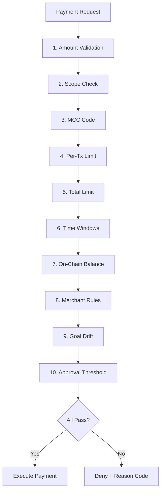

## Overview

Sardis policies are **natural language spending rules** that act as a programmable firewall between AI agents and real money. Every payment must pass through policy validation before execution—if the policy says no, no funds move.

<Note>
  **Policy-first architecture:** Policy checks run before compliance, before gas estimation, before any blockchain interaction. This fail-fast approach prevents wasted resources on transactions that would be denied.
</Note>

## How Policies Work

When an agent attempts a payment, Sardis evaluates it through a **10-check pipeline**. The first failure short-circuits with a denial:



## Trust Levels

Sardis maps agent trust to preset spending limits:

| Trust Level | Per-Tx | Daily | Weekly | Monthly | Total |
|-------------|--------|-------|--------|---------|-------|
| **LOW** | $50 | $100 | $500 | $1,000 | $5,000 |
| **MEDIUM** | $500 | $1,000 | $5,000 | $10,000 | $50,000 |
| **HIGH** | $5,000 | $10,000 | $50,000 | $100,000 | $500,000 |
| **UNLIMITED** | No cap | No cap | No cap | No cap | No cap |

<Info>
  Trust levels automatically map to KYA verification levels: `NONE/BASIC → LOW`, `VERIFIED → MEDIUM`, `ATTESTED → HIGH`.
</Info>

## Creating Policies

### Default Policy (Trust-Based)

```python
from sardis_v2_core.spending_policy import create_default_policy, TrustLevel

# Create a LOW trust policy ($50/tx, $100/day)
policy = create_default_policy(
    agent_id="agent_123",
    trust_level=TrustLevel.LOW
)

print(f"Per-tx limit: ${policy.limit_per_tx}")
print(f"Daily limit: ${policy.daily_limit.limit_amount}")
```

### Custom Policy

```python
from sardis_v2_core.spending_policy import SpendingPolicy, TimeWindowLimit, TrustLevel
from decimal import Decimal

policy = SpendingPolicy(
    agent_id="agent_123",
    trust_level=TrustLevel.MEDIUM,
    limit_per_tx=Decimal("200.00"),
    limit_total=Decimal("5000.00"),
    daily_limit=TimeWindowLimit(
        window_type="daily",
        limit_amount=Decimal("500.00")
    ),
    approval_threshold=Decimal("500.00"),  # Human approval above $500
    blocked_merchant_categories=["gambling", "adult"]
)
```

### Natural Language Policies

Sardis can parse natural language into structured policies:

```python
from sardis_v2_core.nl_policy_parser import parse_policy

policy_text = """
Max $100 per transaction, $500 per day.
Block gambling and alcohol.
Only allow payments to OpenAI, Anthropic, and AWS.
Require approval above $200.
"""

policy = parse_policy(policy_text, agent_id="agent_123")
```

<Tip>
  Natural language parsing uses GPT-4 to extract spending rules. The LLM converts human instructions into the `SpendingPolicy` data structure.
</Tip>

## Time Window Limits

Time-based spending caps automatically reset when the window expires:

```python
from sardis_v2_core.spending_policy import TimeWindowLimit
from decimal import Decimal

# Daily limit: $500/day
daily = TimeWindowLimit(
    window_type="daily",
    limit_amount=Decimal("500.00"),
    currency="USDC"
)

# Check remaining budget
remaining = daily.remaining()
print(f"Remaining today: ${remaining}")

# Record a spend
daily.record_spend(Decimal("50.00"))

# Check if a payment can proceed
can_spend, reason = daily.can_spend(Decimal("100.00"))
if not can_spend:
    print(f"Denied: {reason}")  # "time_window_limit"
```

<AccordionGroup>
  <Accordion title="Daily Limits" icon="calendar-day">
    Resets every 24 hours from the window start time:
    ```python
    daily_limit = TimeWindowLimit(
        window_type="daily",
        limit_amount=Decimal("1000.00")
    )
    ```
  </Accordion>

  <Accordion title="Weekly Limits" icon="calendar-week">
    Resets every 7 days:
    ```python
    weekly_limit = TimeWindowLimit(
        window_type="weekly",
        limit_amount=Decimal("5000.00")
    )
    ```
  </Accordion>

  <Accordion title="Monthly Limits" icon="calendar">
    Resets every 30 days:
    ```python
    monthly_limit = TimeWindowLimit(
        window_type="monthly",
        limit_amount=Decimal("20000.00")
    )
    ```
  </Accordion>
</AccordionGroup>

## Merchant Rules

Control exactly who agents can pay with allowlists, blocklists, and per-merchant caps:

### Allowlist (Restrict to Specific Merchants)

```python
from sardis_v2_core.spending_policy import SpendingPolicy

policy = SpendingPolicy(agent_id="agent_123")

# Only allow OpenAI and Anthropic
policy.add_merchant_allow(merchant_id="openai.com")
policy.add_merchant_allow(merchant_id="anthropic.com")

# Payments to other merchants will be denied with "merchant_not_allowlisted"
```

### Blocklist (Block Specific Merchants)

```python
# Block gambling sites
policy.add_merchant_deny(
    category="gambling",
    reason="Company policy: no gambling payments"
)

# Block a specific merchant temporarily
from datetime import datetime, timedelta

policy.add_merchant_deny(
    merchant_id="suspicious-site.com",
    reason="Under investigation",
    expires_at=datetime.now() + timedelta(days=7)
)
```

### Per-Merchant Caps

```python
# Limit OpenAI to $500/tx, $2000/day
policy.add_merchant_allow(
    merchant_id="openai.com",
    max_per_tx=Decimal("500.00"),
    reason="API spending cap"
)
```

### Category-Based Rules

```python
# Block entire merchant categories
policy.block_merchant_category("gambling")
policy.block_merchant_category("alcohol")
policy.block_merchant_category("adult")

# Unblock a category
policy.unblock_merchant_category("alcohol")
```

## Spending Scopes

Restrict agents to specific spending categories:

```python
from sardis_v2_core.spending_policy import SpendingScope

# Only allow compute and data purchases
policy.allowed_scopes = [
    SpendingScope.COMPUTE,
    SpendingScope.DATA
]

# Available scopes:
# - SpendingScope.ALL (default)
# - SpendingScope.RETAIL
# - SpendingScope.DIGITAL
# - SpendingScope.SERVICES
# - SpendingScope.COMPUTE
# - SpendingScope.DATA
# - SpendingScope.AGENT_TO_AGENT
```

## MCC Code Blocking

Block payments based on Merchant Category Codes (MCCs):

```python
# Block high-risk MCC categories
policy.blocked_merchant_categories = [
    "gambling",      # MCC 7995, 7802, etc.
    "adult",         # MCC 5967
    "weapons",       # MCC 5091
    "cryptocurrency" # MCC 6051
]

# Check MCC during payment
approved, reason = await policy.evaluate(
    wallet=wallet,
    amount=Decimal("50.00"),
    fee=Decimal("0.50"),
    chain="base",
    token=TokenType.USDC,
    mcc_code="7995"  # Online gambling
)

if not approved:
    print(reason)  # "merchant_category_blocked:gambling"
```

## Policy Evaluation

### Async Evaluation (Production)

Use `evaluate()` for full policy enforcement with DB-backed spend tracking:

```python
from sardis_v2_core.spending_policy import SpendingPolicy
from sardis_v2_core.tokens import TokenType
from decimal import Decimal

policy = SpendingPolicy(agent_id="agent_123")

approved, reason = await policy.evaluate(
    wallet=wallet,
    amount=Decimal("50.00"),
    fee=Decimal("0.50"),
    chain="base",
    token=TokenType.USDC,
    merchant_id="openai.com",
    merchant_category="saas",
    mcc_code="5734",
    scope=SpendingScope.DIGITAL,
    rpc_client=rpc_client,          # For balance check
    policy_store=policy_store,      # For DB-backed limits
    drift_score=Decimal("0.2")      # Goal drift detection
)

if approved:
    if reason == "requires_approval":
        # Route to human for approval
        await send_approval_request(policy, amount)
    else:
        # Execute payment
        await execute_payment(wallet, amount)
else:
    print(f"Denied: {reason}")
```

### Sync Validation (Testing/Pre-Flight)

Use `validate_payment()` for quick local checks without DB or RPC calls:

```python
approved, reason = policy.validate_payment(
    amount=Decimal("50.00"),
    fee=Decimal("0.50"),
    merchant_id="openai.com",
    scope=SpendingScope.DIGITAL
)
```

<Warning>
  `validate_payment()` uses in-memory state only. For production, always use `evaluate()` with a `policy_store` to prevent race conditions.
</Warning>

## Goal Drift Detection

Block payments when an agent drifts too far from its stated purpose:

```python
policy.max_drift_score = Decimal("0.5")  # Max 50% drift allowed

# During payment evaluation
approved, reason = await policy.evaluate(
    wallet=wallet,
    amount=Decimal("25.00"),
    fee=Decimal("0.50"),
    chain="base",
    token=TokenType.USDC,
    drift_score=Decimal("0.7")  # 70% drift - exceeds max
)

if not approved:
    print(reason)  # "goal_drift_exceeded"
```

<Info>
  Drift scores are calculated by comparing the agent's current actions to its manifest. A score of 0.0 = perfect alignment, 1.0 = completely off-task.
</Info>

## Approval Thresholds

Require human approval for large transactions while auto-approving small ones:

```python
policy.approval_threshold = Decimal("500.00")

# Payment under threshold: auto-approved
approved, reason = await policy.evaluate(
    wallet=wallet,
    amount=Decimal("100.00"),
    fee=Decimal("1.00"),
    chain="base",
    token=TokenType.USDC
)
print(approved, reason)  # (True, "OK")

# Payment over threshold: requires approval
approved, reason = await policy.evaluate(
    wallet=wallet,
    amount=Decimal("600.00"),
    fee=Decimal("1.00"),
    chain="base",
    token=TokenType.USDC
)
print(approved, reason)  # (True, "requires_approval")
```

## Code Examples

### Example 1: E-Commerce Bot Policy

```python ecommerce_policy.py
from sardis_v2_core.spending_policy import (
    SpendingPolicy,
    TimeWindowLimit,
    TrustLevel,
    SpendingScope
)
from decimal import Decimal

# Create policy for shopping agent
policy = SpendingPolicy(
    agent_id="ecommerce_bot_001",
    trust_level=TrustLevel.MEDIUM,
    limit_per_tx=Decimal("200.00"),
    limit_total=Decimal("10000.00"),
    approval_threshold=Decimal("500.00")
)

# Daily budget: $1000
policy.daily_limit = TimeWindowLimit(
    window_type="daily",
    limit_amount=Decimal("1000.00")
)

# Only allow retail purchases
policy.allowed_scopes = [SpendingScope.RETAIL]

# Allowlist approved merchants
for merchant in ["amazon.com", "shopify.com", "stripe.com"]:
    policy.add_merchant_allow(merchant_id=merchant)

# Block gambling and adult content
policy.block_merchant_category("gambling")
policy.block_merchant_category("adult")

print(f"Policy created: {policy.policy_id}")
```

### Example 2: API Credits Policy

```python api_credits_policy.py
from sardis_v2_core.spending_policy import (
    create_default_policy,
    TrustLevel
)
from decimal import Decimal

# Create HIGH trust policy for API agent
policy = create_default_policy(
    agent_id="api_agent_001",
    trust_level=TrustLevel.HIGH
)

# Allowlist AI providers with per-merchant caps
policy.add_merchant_allow(
    merchant_id="openai.com",
    max_per_tx=Decimal("500.00"),
    reason="GPT-4 API credits"
)

policy.add_merchant_allow(
    merchant_id="anthropic.com",
    max_per_tx=Decimal("500.00"),
    reason="Claude API credits"
)

policy.add_merchant_allow(
    merchant_id="aws.com",
    max_per_tx=Decimal("1000.00"),
    reason="AWS infrastructure"
)

# Scope: compute only
from sardis_v2_core.spending_policy import SpendingScope
policy.allowed_scopes = [SpendingScope.COMPUTE]
```

## Policy Data Model

```python
@dataclass
class SpendingPolicy:
    policy_id: str
    agent_id: str
    trust_level: TrustLevel
    limit_per_tx: Decimal
    limit_total: Decimal
    spent_total: Decimal
    daily_limit: Optional[TimeWindowLimit]
    weekly_limit: Optional[TimeWindowLimit]
    monthly_limit: Optional[TimeWindowLimit]
    merchant_rules: list[MerchantRule]
    allowed_scopes: list[SpendingScope]
    blocked_merchant_categories: list[str]
    approval_threshold: Optional[Decimal]
    max_drift_score: Optional[Decimal]
    created_at: datetime
    updated_at: datetime
```

## Reason Codes

When a policy denies a payment, it returns a reason code:

| Code | Description |
|------|-------------|
| `per_transaction_limit` | Single payment exceeds per-tx cap |
| `total_limit_exceeded` | Lifetime spending cap reached |
| `daily_limit_exceeded` | Daily window exhausted |
| `weekly_limit_exceeded` | Weekly window exhausted |
| `monthly_limit_exceeded` | Monthly window exhausted |
| `merchant_denied` | Merchant on blocklist |
| `merchant_not_allowlisted` | Merchant not on allowlist |
| `merchant_cap_exceeded` | Per-merchant cap exceeded |
| `merchant_category_blocked` | MCC category blocked |
| `scope_not_allowed` | Wrong spending category |
| `insufficient_balance` | Wallet can't cover payment |
| `goal_drift_exceeded` | Agent off-task |
| `requires_approval` | Needs human sign-off |

## Next Steps

<CardGroup cols={2}>
  <Card title="Agents" icon="robot" href="/concepts/agents">
    Create AI agents with policy-enforced wallets
  </Card>
  <Card title="Payments" icon="money-bill-transfer" href="/concepts/payments">
    Execute payments through the policy firewall
  </Card>
  <Card title="Compliance" icon="building-shield" href="/concepts/compliance">
    KYC/AML and sanctions screening
  </Card>
  <Card title="Wallets" icon="wallet" href="/concepts/wallets">
    Non-custodial MPC wallets
  </Card>
</CardGroup>
