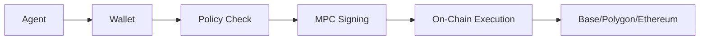

## Overview

Sardis wallets are **non-custodial, MPC-secured** wallets designed specifically for AI agents. Unlike traditional custodial wallets, Sardis never holds your funds or private keys—all assets remain on-chain, and transactions are signed using Multi-Party Computation (MPC) through providers like Turnkey or Fireblocks.

<Note>
  **Non-custodial means:** 
  - Funds are held on-chain, not in our database
  - Balances are read directly from the blockchain
  - Private keys never leave secure enclaves
  - You maintain full custody of your agent's assets
</Note>

## Architecture

Every AI agent has its own programmable wallet that enforces spending policies before executing transactions:



## Supported Chains & Tokens

Sardis wallets support multi-chain stablecoin payments:

| Chain | Supported Tokens |
|-------|------------------|
| **Arc** (Circle L1) | USDC, EURC |
| **Base** | USDC, EURC |
| **Polygon** | USDC, USDT, EURC |
| **Ethereum** | USDC, USDT, PYUSD, EURC |
| **Arbitrum** | USDC, USDT |
| **Optimism** | USDC, USDT |

<Tip>
  Base is recommended for lowest transaction costs and fastest confirmation times.
</Tip>

## Creating a Wallet

### Simple SDK

```python
from sardis import Agent

# Create an agent with a wallet
agent = Agent(name="Shopping Assistant")
wallet = agent.create_wallet(
    initial_balance=100,
    currency="USDC",
    limit_per_tx=50,
    limit_total=1000
)

print(f"Wallet ID: {wallet.wallet_id}")
print(f"Balance: ${wallet.balance} {wallet.currency}")
```

### Core API

```python
from sardis_v2_core import Wallet, TokenType

# Create a new non-custodial wallet
wallet = Wallet.new(
    agent_id="agent_xxx",
    mpc_provider="turnkey",  # or "fireblocks", "local"
    account_type="mpc_v1",
    currency="USDC"
)

# Set address for a specific chain
wallet.set_address("base", "0x742d35Cc6634C0532925a3b844Bc9e7595f0bEb")
```

## Reading On-Chain Balances

Balances are **always read directly from the blockchain**, never stored in our database:

```python
from sardis_v2_core import Wallet, TokenType
from sardis_chain import ChainRPCClient

# Get wallet balance from chain
rpc_client = ChainRPCClient(chain="base")
balance = await wallet.get_balance(
    chain="base",
    token=TokenType.USDC,
    rpc_client=rpc_client
)

print(f"Balance: {balance} USDC")
```

<Info>
  Balances are queried using the ERC20 `balanceOf` function. Sardis never caches balances—you always get real-time data.
</Info>

## Wallet Types

Sardis supports multiple wallet architectures:

<AccordionGroup>
  <Accordion title="MPC v1 (Recommended)" icon="shield-halved">
    **Multi-Party Computation wallets** using Turnkey or Fireblocks:
    - No single point of failure
    - Private keys distributed across secure enclaves
    - Threshold signing (2-of-3 or 3-of-5)
    - FIPS 140-2 Level 3 certified HSMs
    
    ```python
    wallet = Wallet.new(
        agent_id="agent_123",
        mpc_provider="turnkey",
        account_type="mpc_v1"
    )
    ```
  </Accordion>

  <Accordion title="ERC-4337 v2 (Account Abstraction)" icon="bezier-curve">
    **Smart contract wallets** with gasless transactions:
    - Sponsored gas via paymasters
    - Batched transactions
    - Session keys for recurring payments
    - Social recovery
    
    ```python
    wallet = Wallet.new(
        agent_id="agent_123",
        account_type="erc4337_v2",
        paymaster_enabled=True
    )
    ```
  </Accordion>

  <Accordion title="Safe v1 (Multi-Sig)" icon="users">
    **Gnosis Safe multi-signature wallets**:
    - Multiple owners (humans + agents)
    - Configurable threshold (e.g., 2-of-3)
    - On-chain governance
    - Time-locked transactions
    
    ```python
    wallet = Wallet.new(
        agent_id="agent_123",
        account_type="safe_v1"
    )
    ```
  </Accordion>
</AccordionGroup>

## Funding & Withdrawals

### Funding a Wallet

Since wallets are non-custodial, you fund them by sending tokens directly to the wallet's on-chain address:

```python
# Get the wallet address for a specific chain
address = wallet.get_address("base")
print(f"Send USDC to: {address} on Base")

# After sending, check the balance
balance = await wallet.get_balance(
    chain="base",
    token=TokenType.USDC,
    rpc_client=rpc_client
)
```

<Warning>
  Always verify the chain and token address before sending funds. Sending tokens to the wrong chain or contract address will result in permanent loss.
</Warning>

### Withdrawing Funds

Withdraw funds to an external address:

```python
from sardis import Agent

agent = Agent(name="My Agent")
result = agent.pay(
    to="0x742d35Cc6634C0532925a3b844Bc9e7595f0bEb",
    amount=50,
    purpose="Withdrawal to external wallet"
)

if result.success:
    print(f"Withdrawal successful: {result.tx_hash}")
```

## Wallet Limits

Wallets have configurable spending limits that work alongside policies:

```python
from decimal import Decimal

# Set per-transaction limit
wallet.limit_per_tx = Decimal("100.00")

# Set total lifetime limit
wallet.limit_total = Decimal("5000.00")

# Token-specific limits
from sardis_v2_core import TokenLimit, TokenType

wallet.token_limits["USDC"] = TokenLimit(
    token=TokenType.USDC,
    limit_per_tx=Decimal("200.00"),
    limit_total=Decimal("10000.00")
)
```

## Wallet Security

### Freezing a Wallet

Wallets can be frozen to block all transactions (e.g., for compliance violations or suspicious activity):

```python
# Freeze the wallet
wallet.freeze(
    by="admin@company.com",
    reason="Suspicious activity detected"
)

# Check if frozen
if wallet.is_frozen:
    print(f"Frozen by: {wallet.frozen_by}")
    print(f"Reason: {wallet.freeze_reason}")

# Unfreeze when resolved
wallet.unfreeze()
```

### Virtual Cards

Wallets can be linked to virtual debit cards for fiat rails (via Lithic):

```python
from sardis_v2_core import VirtualCard

# Attach a virtual card to the wallet
wallet.virtual_card = VirtualCard(
    card_id="card_123",
    last_four="4242",
    exp_month=12,
    exp_year=2025,
    network="VISA"
)

# Use for fiat payments
result = await wallet.pay_with_card(
    merchant="stripe.com",
    amount=Decimal("25.00")
)
```

## Code Example: Full Wallet Lifecycle

```python wallet_lifecycle.py
from sardis import Agent, Policy
from decimal import Decimal

# Step 1: Create an agent with a wallet
agent = Agent(
    name="E-commerce Bot",
    description="Autonomous shopping agent",
    policy=Policy(
        max_per_tx=100,
        max_total=1000,
        allowed_destinations={"amazon.*", "shopify.*"}
    )
)

# Step 2: Create wallet
wallet = agent.create_wallet(
    initial_balance=500,
    currency="USDC",
    limit_per_tx=100,
    limit_total=1000
)

print(f"Created wallet: {wallet.wallet_id}")
print(f"Initial balance: ${wallet.balance}")

# Step 3: Make a payment
result = agent.pay(
    to="merchant:shopify",
    amount=25,
    purpose="Product purchase"
)

if result.success:
    print(f"Payment successful: {result.tx_hash}")
    print(f"New balance: ${agent.primary_wallet.balance}")
    print(f"Spent total: ${agent.primary_wallet.spent_total}")
    print(f"Remaining limit: ${agent.primary_wallet.remaining_limit()}")
else:
    print(f"Payment failed: {result.message}")
```

## API Reference

### Wallet Model

```python
class Wallet(BaseModel):
    wallet_id: str
    agent_id: str
    mpc_provider: str  # "turnkey" | "fireblocks" | "local"
    account_type: Literal["mpc_v1", "erc4337_v2", "safe_v1"]
    addresses: dict[str, str]  # chain -> address mapping
    currency: str  # Default display currency
    limit_per_tx: Decimal
    limit_total: Decimal
    is_active: bool
    is_frozen: bool
    created_at: datetime
    updated_at: datetime
```

### Key Methods

<CodeGroup>
```python get_balance()
balance = await wallet.get_balance(
    chain="base",
    token=TokenType.USDC,
    rpc_client=rpc_client
)
# Returns: Decimal (e.g., Decimal("100.00"))
```

```python sign_transaction()
signed_tx = await wallet.sign_transaction(
    chain="base",
    to_address="0x...",
    amount=Decimal("25.00"),
    token=TokenType.USDC,
    mpc_signer=signer
)
# Returns: str (signed transaction hex)
```

```python freeze()
wallet.freeze(
    by="admin@example.com",
    reason="Compliance review"
)
# Blocks all transactions until unfrozen
```
</CodeGroup>

## Next Steps

<CardGroup cols={2}>
  <Card title="Policies" icon="shield-check" href="/concepts/policies">
    Learn how to enforce spending rules with natural language policies
  </Card>
  <Card title="Agents" icon="robot" href="/concepts/agents">
    Create AI agents with payment capabilities
  </Card>
  <Card title="Payments" icon="money-bill-transfer" href="/concepts/payments">
    Understand the payment execution flow
  </Card>
  <Card title="Compliance" icon="building-shield" href="/concepts/compliance">
    KYC/AML and Know Your Agent verification
  </Card>
</CardGroup>
