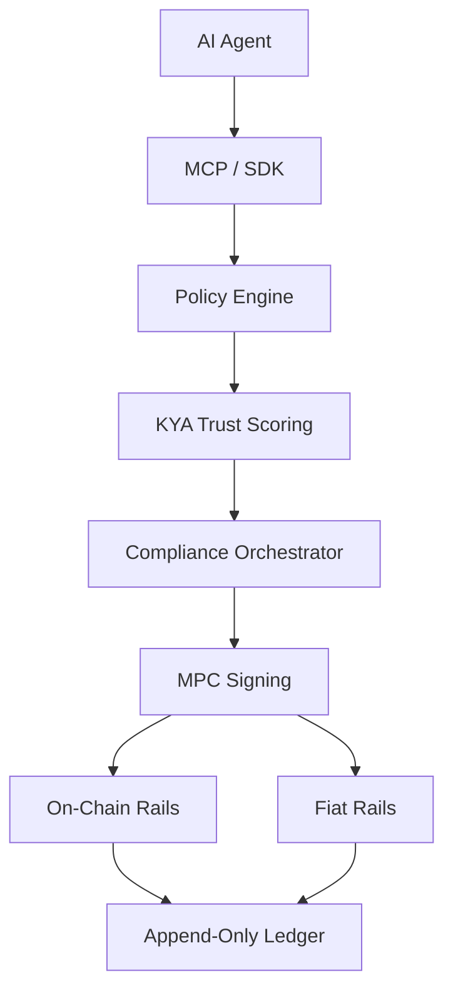

## The Problem: AI Agents Can't Be Trusted With Money

AI agents can reason, plan, and execute complex workflows — but they hallucinate. When an agent hallucinates in a payment context, it might send $10,000 instead of $100, pay the wrong vendor, or violate compliance rules.

**Financial hallucinations are the #1 barrier to autonomous agent commerce.**

## The Solution: Policy-Enforced MPC Wallets

Sardis gives AI agents **non-custodial MPC wallets** with **natural language spending policies**. Every transaction is validated against programmable guardrails before execution:

- "Max $100 per transaction, $500 per day"
- "Only approved SaaS vendors"
- "No gambling or high-risk merchants"
- "Require human approval for transactions over $1,000"

The agent **cannot override these policies**. Sardis acts as a real-time policy firewall, preventing financial hallucinations before they happen.

## How It Works

<Steps>
  <Step title="Create an Agent">
    Register your AI agent (Claude, GPT-4, LangChain, etc.) with Sardis
  </Step>
  <Step title="Create a Wallet">
    Provision a non-custodial MPC wallet with spending policies
  </Step>
  <Step title="Define Policies">
    Set natural language spending rules: limits, merchant allowlists, time-based controls
  </Step>
  <Step title="Execute Payments">
    Your agent makes payments — Sardis validates every transaction against your policies
  </Step>
</Steps>

## Key Features

<CardGroup cols={2}>
  <Card
    title="Non-Custodial MPC Wallets"
    icon="shield-halved"
    href="/concepts/wallets"
  >
    Turnkey/Fireblocks integration. Zero private key exposure. Distributed key shares across secure enclaves.
  </Card>
  <Card
    title="Natural Language Policies"
    icon="message-lines"
    href="/concepts/policies"
  >
    "Max $50/tx, $200/day, SaaS vendors only" — write spending rules in plain English
  </Card>
  <Card
    title="Financial Hallucination Prevention"
    icon="ban"
    href="/security/policy-enforcement"
  >
    Real-time policy firewall blocks invalid transactions before execution
  </Card>
  <Card
    title="9 AI Framework Integrations"
    icon="plug"
    href="/integrations/mcp"
  >
    MCP, LangChain, OpenAI, Vercel AI, CrewAI, LlamaIndex, Mastra, Gemini, Anthropic
  </Card>
  <Card
    title="Virtual Cards"
    icon="credit-card"
    href="/guides/virtual-cards"
  >
    Instant Visa/Mastercard issuance via Lithic for fiat payments
  </Card>
  <Card
    title="Agent-to-Agent Escrow"
    icon="handshake"
    href="/guides/agent-to-agent"
  >
    Cryptographic mandate chain for secure agent-to-agent payments
  </Card>
  <Card
    title="KYA (Know Your Agent)"
    icon="chart-line"
    href="/concepts/compliance"
  >
    Trust scoring and behavioral anomaly detection for AI agents
  </Card>
  <Card
    title="5 Blockchain Networks"
    icon="link"
    href="/blockchain/supported-chains"
  >
    Base, Polygon, Ethereum, Arbitrum, Optimism — USDC, USDT, EURC, PYUSD
  </Card>
</CardGroup>

## Quick Example

<CodeGroup>

```python Python
from sardis import Sardis

sardis = Sardis(api_key="sk_...")
result = sardis.payments.create(
    agent_id="agent_abc",
    amount="50.00",
    token="USDC",
    recipient="merchant@example.com"
)
print(f"Payment: {result.tx_hash}")
```

```typescript TypeScript
import { SardisClient } from '@sardis/sdk';

const client = new SardisClient({ apiKey: 'sk_...' });
const agent = await client.agents.create({ name: 'my-agent' });
const wallet = await client.wallets.create({
  agent_id: agent.agent_id,
  currency: 'USDC',
  limit_per_tx: '100.00',
});
const tx = await client.wallets.transfer(wallet.wallet_id, {
  destination: '0x...',
  amount: '25.00',
  token: 'USDC',
  chain: 'base',
});
```

```json MCP (Claude Desktop)
{
  "mcpServers": {
    "sardis": {
      "command": "npx",
      "args": ["-y", "@sardis/mcp-server"],
      "env": {
        "SARDIS_API_KEY": "sk_..."
      }
    }
  }
}
```

</CodeGroup>

## Supported Payment Rails

### On-Chain (Stablecoins)

- **USDC** on Base, Polygon, Ethereum, Arbitrum, Optimism, Arc (Circle L1)
- **USDT** on Polygon, Ethereum, Arbitrum, Optimism
- **EURC** on Base, Polygon, Ethereum, Arc
- **PYUSD** on Ethereum

### Fiat (Virtual Cards)

- **Visa/Mastercard** virtual cards via Lithic
- Instant card issuance with spending limits
- Merchant category controls
- Real-time transaction notifications

### Traditional Banking

- **ACH transfers** (US domestic)
- **Wire transfers** (international)
- **SEPA** (European payments)

<Info>
  All payment rails enforce the same spending policies — whether your agent pays with USDC on Base or a virtual Visa card.
</Info>

## Protocol Compliance

Sardis implements industry-standard payment protocols:

- **AP2 (Agent Payment Protocol)** — Google, PayPal, Mastercard, Visa consortium standard
- **TAP (Trust Anchor Protocol)** — Ed25519 and ECDSA-P256 identity verification
- **UCP (Universal Checkout Protocol)** — Standardized merchant checkout flows
- **A2A (Agent-to-Agent)** — Cryptographic mandate chain for agent payments
- **x402 Payment Required** — HTTP-native payment negotiation

## Architecture



<CardGroup cols={3}>
  <Card
    title="Policy Engine"
    icon="shield-check"
  >
    Natural language rules, merchant allowlists, amount limits, time-based controls
  </Card>
  <Card
    title="KYA Scoring"
    icon="chart-simple"
  >
    Trust scoring and behavioral anomaly detection for agents
  </Card>
  <Card
    title="Compliance"
    icon="scale-balanced"
  >
    KYC via Persona, AML via Elliptic, sanctions screening
  </Card>
  <Card
    title="MPC Custody"
    icon="key"
  >
    Non-custodial Turnkey/Fireblocks integration
  </Card>
  <Card
    title="Multi-Chain"
    icon="network-wired"
  >
    5 blockchain networks, automatic chain routing
  </Card>
  <Card
    title="Audit Ledger"
    icon="book"
  >
    Append-only double-entry ledger with cryptographic proofs
  </Card>
</CardGroup>

## Use Cases

<AccordionGroup>
  <Accordion title="Autonomous Procurement Agents">
    LangChain or CrewAI agents that purchase SaaS tools, API credits, and cloud services with automatic policy enforcement.
  </Accordion>
  <Accordion title="AI-Powered Expense Management">
    Agents that categorize expenses, enforce budgets, and generate compliance reports — with real payment execution.
  </Accordion>
  <Accordion title="Agent-to-Agent Marketplaces">
    AI agents buying and selling services from each other with cryptographic escrow and dispute resolution.
  </Accordion>
  <Accordion title="Subscription Management Bots">
    Agents that automatically renew subscriptions, negotiate pricing, and cancel unused services.
  </Accordion>
  <Accordion title="Cross-Border Payments">
    Stablecoin payments with instant settlement and compliance checks — no banks required.
  </Accordion>
</AccordionGroup>

## What's Next?

<CardGroup cols={2}>
  <Card
    title="Quickstart"
    icon="rocket"
    href="/quickstart"
  >
    Get your first agent payment running in under 5 minutes
  </Card>
  <Card
    title="Installation"
    icon="download"
    href="/installation"
  >
    Install the Python SDK, TypeScript SDK, or MCP server
  </Card>
  <Card
    title="API Reference"
    icon="code"
    href="/api/overview"
  >
    Complete API documentation and endpoint reference
  </Card>
  <Card
    title="Examples"
    icon="book-open"
    href="/resources/examples"
  >
    Production-ready code examples for all frameworks
  </Card>
</CardGroup>

<Note>
  **Need help?** Join our [Discord community](https://discord.gg/XMA9JwDJ) or email support@sardis.sh
</Note>