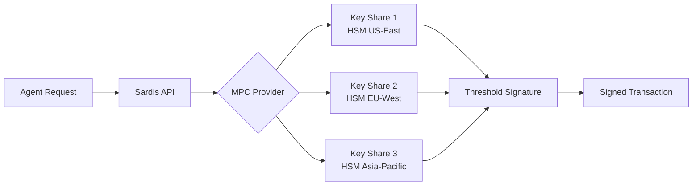

## Overview

Sardis uses **Multi-Party Computation (MPC)** to provide non-custodial wallet infrastructure for AI agents. Private keys never exist in a single location—instead, they're split across multiple independent parties, ensuring that no single entity (including Sardis) can access agent funds.

<Info>
**Key Principle**: Sardis never has custody of your agent's private keys. All signing operations happen through distributed MPC protocols with Turnkey or Circle.
</Info>

## Supported MPC Providers

Sardis integrates with two production-grade MPC providers:

### Turnkey

- **Type**: Enterprise MPC-as-a-Service
- **Key Management**: Hardware-backed distributed key generation
- **Signing**: P-256 ECDSA authentication with API stamps
- **Chains**: Ethereum, Base, Polygon, Arbitrum, Optimism, Solana
- **Use Case**: High-security production deployments

```python
from sardis_wallet import TurnkeyClient

client = TurnkeyClient(
    api_key=os.getenv("TURNKEY_API_PUBLIC_KEY"),
    api_private_key=os.getenv("TURNKEY_API_PRIVATE_KEY"),
    organization_id=os.getenv("TURNKEY_ORGANIZATION_ID"),
)

# Create non-custodial wallet
wallet = await client.create_wallet("agent-wallet-001")
accounts = await client.create_wallet_accounts(
    wallet_id=wallet["walletId"],
    chain_type="CHAIN_TYPE_ETHEREUM",
    count=1,
)
```

### Circle Programmable Wallets

- **Type**: Developer-controlled MPC wallets
- **Key Management**: Circle's W3S infrastructure
- **Signing**: Entity secret encryption
- **Chains**: Base, Ethereum, Polygon, Arbitrum, Optimism, Solana
- **Smart Contract Accounts**: Native support for account abstraction
- **Use Case**: Rapid prototyping, USDC-native applications (free for under 1,000 wallets)

```python
from sardis_wallet import CircleWalletClient

client = CircleWalletClient(
    api_key=os.getenv("CIRCLE_WALLET_API_KEY"),
    entity_secret=os.getenv("CIRCLE_ENTITY_SECRET"),
)

# Create wallet set
wallet_set_id = await client.create_wallet_set("sardis-agents")

# Create wallet on Base
wallets = await client.create_wallet(
    wallet_set_id=wallet_set_id,
    blockchains=["base"],
    account_type="SCA",  # Smart Contract Account
)
```

## Non-Custodial Architecture

### Key Generation

1. **Distributed Generation**: Keys are generated using threshold cryptography
2. **No Single Point of Failure**: Key shares are stored across geographically distributed HSMs
3. **Zero-Knowledge**: Sardis never sees the full private key at any point



### Transaction Signing Flow

<Steps>
  <Step title="Policy Validation">
    Sardis spending policy engine validates the transaction against agent-specific rules
  </Step>
  <Step title="MPC Signing Request">
    Sardis forwards the unsigned transaction to the MPC provider with authenticated credentials
  </Step>
  <Step title="Distributed Signing">
    MPC nodes coordinate to generate a signature without reconstructing the private key
  </Step>
  <Step title="Signature Assembly">
    The final signature is assembled from partial signatures and returned to Sardis
  </Step>
  <Step title="Broadcast">
    Sardis broadcasts the signed transaction to the blockchain RPC
  </Step>
</Steps>

## Security Guarantees

### No Private Key Exposure

<CardGroup cols={2}>
  <Card title="Threshold Security" icon="lock">
    Private keys are split using Shamir's Secret Sharing—no single party holds enough information to sign
  </Card>
  <Card title="HSM Protection" icon="microchip">
    All key shares are stored in FIPS 140-2 Level 3 Hardware Security Modules
  </Card>
  <Card title="Encrypted Transit" icon="shield">
    All MPC communication uses TLS 1.3 with mutual authentication
  </Card>
  <Card title="Audit Logs" icon="file-lines">
    Every signing operation is logged with cryptographic proofs
  </Card>
</CardGroup>

### Authentication & Authorization

**Turnkey**: Uses P-256 ECDSA stamps—every API request is signed with your private key

```python
def _create_stamp(self, body: str) -> str:
    """Create Turnkey API stamp (base64url JSON envelope)."""
    signature = self._signing_key.sign(
        body.encode(), 
        ec.ECDSA(hashes.SHA256())
    )
    stamp_payload = {
        "publicKey": self._api_key,
        "scheme": "SIGNATURE_SCHEME_TK_API_P256",
        "signature": signature.hex(),
    }
    return base64.urlsafe_b64encode(
        json.dumps(stamp_payload).encode()
    ).decode().rstrip("=")
```

**Circle**: Uses entity secrets encrypted with Circle's RSA public key

```python
async def sign_transaction(
    self,
    wallet_id: str,
    raw_transaction: str,
) -> CircleTransaction:
    data = await self._request(
        "POST",
        "/developer/transactions/contractExecution",
        json={
            "walletId": wallet_id,
            "callData": raw_transaction,
            "entitySecretCiphertext": self._build_entity_secret_cipher(),
        },
    )
    return CircleTransaction(
        tx_id=data["id"],
        state=data["state"],
        tx_hash=data.get("txHash"),
    )
```

## Recovery & Continuity

### Key Rotation

Sardis supports scheduled and emergency key rotation:

```python
from sardis_wallet import EnhancedWalletManager

manager = EnhancedWalletManager(settings)

# Scheduled rotation (every 90 days)
event = await manager.rotate_wallet_key(
    wallet_id="wallet_abc123",
    reason="scheduled",
    initiated_by="system",
)

# Emergency rotation (compromise detected)
event = await manager.emergency_key_rotation(
    wallet_id="wallet_abc123",
    reason="potential_compromise",
    initiated_by="security_team",
)
```

Location: `packages/sardis-wallet/src/sardis_wallet/key_rotation.py`

### Social Recovery

Multi-guardian recovery for lost access:

```python
# Setup recovery with 3 guardians (2-of-3 threshold)
await manager.setup_social_recovery(
    wallet_id="wallet_abc123",
    guardians=[
        {"guardian_id": "guardian_1", "contact": "alice@example.com"},
        {"guardian_id": "guardian_2", "contact": "bob@example.com"},
        {"guardian_id": "guardian_3", "contact": "carol@example.com"},
    ],
    recovery_secret=b"encrypted_key_material",
    threshold=2,
)

# Initiate recovery
recovery = await manager.initiate_recovery(
    wallet_id="wallet_abc123",
    requester_proof="signed_ownership_proof",
)
```

Location: `packages/sardis-wallet/src/sardis_wallet/social_recovery.py`

## Code References

- **Turnkey Client**: `packages/sardis-wallet/src/sardis_wallet/turnkey_client.py`
- **Circle Client**: `packages/sardis-wallet/src/sardis_wallet/circle_client.py`
- **Wallet Manager**: `packages/sardis-wallet/src/sardis_wallet/manager.py`
- **Key Rotation**: `packages/sardis-wallet/src/sardis_wallet/key_rotation.py`
- **Social Recovery**: `packages/sardis-wallet/src/sardis_wallet/social_recovery.py`

## Production Checklist

<AccordionGroup>
  <Accordion title="Environment Configuration">
    ```bash
    # Turnkey (Required)
    TURNKEY_API_PUBLIC_KEY=your_public_key
    TURNKEY_API_PRIVATE_KEY=your_private_key_hex
    TURNKEY_ORGANIZATION_ID=your_org_id

    # Circle (Alternative)
    CIRCLE_WALLET_API_KEY=your_api_key
    CIRCLE_ENTITY_SECRET=your_entity_secret
    CIRCLE_WALLET_SET_ID=your_wallet_set_id  # Optional
    ```
  </Accordion>
  
  <Accordion title="Security Hardening">
    - Store MPC credentials in AWS Secrets Manager / HashiCorp Vault
    - Rotate API keys every 90 days
    - Enable IP allowlisting on MPC provider dashboards
    - Set up monitoring for unusual signing activity
    - Configure webhooks for key rotation events
  </Accordion>
  
  <Accordion title="Backup Strategy">
    - Export wallet metadata (NOT private keys) to encrypted storage
    - Store recovery guardian contact information securely
    - Document key rotation procedures
    - Test recovery flow in staging environment
  </Accordion>
</AccordionGroup>

<Warning>
Never commit MPC credentials to git. Always use environment variables or secrets managers. Sardis validates that `.env` is in `.gitignore`.
</Warning>

## Next Steps

<CardGroup cols={2}>
  <Card title="Policy Enforcement" icon="gavel" href="/security/policy-enforcement">
    Learn how spending policies act as a firewall before MPC signing
  </Card>
  <Card title="Threat Model" icon="triangle-exclamation" href="/security/threat-model">
    Understand attack surfaces and mitigation strategies
  </Card>
</CardGroup>