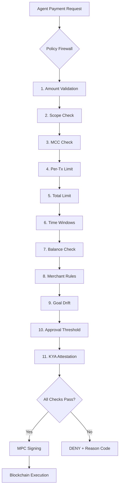

## Overview

Sardis implements a **fail-closed policy firewall** that validates every payment before it reaches the MPC signing layer. This prevents financial hallucinations, off-task spending, and policy violations—even if an AI agent is compromised or behaves unexpectedly.

<Warning>
**Fail-Closed Design**: If any policy check fails or throws an exception, the transaction is automatically denied. No payment can bypass policy enforcement.
</Warning>

## Policy Architecture

Every AI agent has a `SpendingPolicy` that defines:

- **Amount limits**: Per-transaction, daily, weekly, monthly, and lifetime caps
- **Merchant controls**: Allowlists, blocklists, per-merchant caps
- **Scope restrictions**: Limit spending to specific categories (compute, retail, etc.)
- **MCC blocking**: Block entire merchant category codes (gambling, adult content)
- **Goal drift detection**: Prevent off-task spending
- **Approval routing**: Auto-approve small payments, require human sign-off for large ones



## Evaluation Pipeline

Location: `packages/sardis-core/src/sardis_v2_core/spending_policy.py:246-417`

Every payment goes through a **10-step check pipeline**. The first failure short-circuits with a denial reason:

### 1. Amount Validation

```python
if amount <= 0:
    return False, "amount_must_be_positive"
if fee < 0:
    return False, "fee_must_be_non_negative"

total_cost = amount + fee  # All limits include gas fees
```

### 2. Scope Check

```python
if SpendingScope.ALL not in self.allowed_scopes and scope not in self.allowed_scopes:
    return False, "scope_not_allowed"
```

**Supported Scopes**:
- `ALL` — No restrictions
- `RETAIL` — Physical goods, groceries, etc.
- `DIGITAL` — Software, subscriptions
- `SERVICES` — Professional services
- `COMPUTE` — Cloud compute, API credits
- `DATA` — Data purchases, feeds
- `AGENT_TO_AGENT` — Inter-agent payments

### 3. MCC Check

Block entire merchant categories by [4-digit MCC code](https://www.irs.gov/pub/irs-pdf/p378.pdf):

```python
if mcc_code:
    mcc_ok, mcc_reason = self._check_mcc_policy(mcc_code)
    if not mcc_ok:
        return False, mcc_reason
```

Location: `spending_policy.py:606-627`

**High-Risk MCCs (Blocked by Default)**:
- `7995` — Gambling
- `5967` — Adult content
- `6012` — Payday loans
- `5993` — Tobacco

### 4. Per-Transaction Limit

```python
effective_per_tx = self._get_effective_per_tx_limit(mcc_code, merchant_category)
if total_cost > effective_per_tx:
    return False, "per_transaction_limit"
```

**Category-Specific Overrides**:
You can set different limits per category:

```python
policy.add_merchant_allow(
    category="cloud",
    max_per_tx=Decimal("500.00"),  # Allow up to $500 for cloud services
)
policy.add_merchant_allow(
    category="groceries",
    max_per_tx=Decimal("100.00"),  # Cap groceries at $100
)
```

Location: `spending_policy.py:560-586`

### 5. Total Limit

```python
if self.spent_total + total_cost > self.limit_total:
    return False, "total_limit_exceeded"
```

Cumulative spend is tracked in the database to prevent race conditions.

### 6. Time-Window Limits

Rolling daily/weekly/monthly caps:

```python
for window_limit in [self.daily_limit, self.weekly_limit, self.monthly_limit]:
    ok, reason = window_limit.can_spend(total_cost)
    if not ok:
        return ok, reason  # "daily_limit_exceeded", etc.
```

Location: `spending_policy.py:96-141`

**Auto-Reset**: Windows reset automatically when they expire:

```python
def reset_if_expired(self) -> bool:
    now = datetime.now(timezone.utc)
    if self.window_type == "daily":
        duration = timedelta(days=1)
    elif self.window_type == "weekly":
        duration = timedelta(weeks=1)
    elif self.window_type == "monthly":
        duration = timedelta(days=30)
    else:
        return False
    if now >= self.window_start + duration:
        self.current_spent = Decimal("0")
        self.window_start = now
        return True
    return False
```

### 7. On-Chain Balance Check

```python
if rpc_client:
    balance = await wallet.get_balance(chain, token, rpc_client)
    if balance < total_cost:
        return False, "insufficient_balance"
```

<Info>
Sardis is non-custodial—the agent's actual blockchain balance is the source of truth.
</Info>

### 8. Merchant Rules

**Deny Rules** (checked first):

```python
for rule in self.merchant_rules:
    if rule.rule_type == "deny" and rule.matches_merchant(merchant_id, merchant_category):
        return False, "merchant_denied"
```

**Allow Rules** (allowlist enforcement):

```python
allow_rules = [rule for rule in self.merchant_rules if rule.rule_type == "allow"]
if allow_rules:
    match = next((r for r in allow_rules if r.matches_merchant(merchant_id, merchant_category)), None)
    if not match:
        return False, "merchant_not_allowlisted"
    if match.max_per_tx and amount > match.max_per_tx:
        return False, "merchant_cap_exceeded"
```

Location: `spending_policy.py:588-604`

### 9. Goal Drift Detection

```python
if drift_score is not None and self.max_drift_score is not None:
    if drift_score > self.max_drift_score:
        return False, "goal_drift_exceeded"
```

**Drift Scoring**: Measures how far the agent has deviated from its stated objective. Requires integration with an external drift detection service.

### 10. Approval Threshold

```python
if self.approval_threshold is not None and amount > self.approval_threshold:
    return True, "requires_approval"
```

Approved transactions that exceed the threshold return `(True, "requires_approval")` and are routed to a human for sign-off.

### 11. KYA Attestation (MEDIUM/HIGH Trust)

For MEDIUM and HIGH trust agents, verify on-chain KYA attestation:

```python
if kya_client and self.trust_level in (TrustLevel.MEDIUM, TrustLevel.HIGH):
    kya_ok, kya_reason = await self._check_kya_attestation(wallet, kya_client)
    if not kya_ok:
        return False, kya_reason
```

Location: `spending_policy.py:629-664`

## Trust Levels

Sardis uses **trust levels** to determine default spending limits:

| Trust Level | Per-Tx | Daily | Weekly | Monthly | Total |
|-------------|--------|-------|--------|---------|-------|
| **LOW** | $50 | $100 | $500 | $1,000 | $5,000 |
| **MEDIUM** | $500 | $1,000 | $5,000 | $10,000 | $50,000 |
| **HIGH** | $5,000 | $10,000 | $50,000 | $100,000 | $500,000 |
| **UNLIMITED** | No cap | No cap | No cap | No cap | No cap |

Location: `spending_policy.py:724-742`

**Default Policy Creation**:

```python
from sardis_v2_core import create_default_policy, TrustLevel

policy = create_default_policy(
    agent_id="agent_123",
    trust_level=TrustLevel.LOW,
)
```

## Real-Time Validation

Policies are evaluated **synchronously** before every transaction:

```python
from sardis_wallet import EnhancedWalletManager

manager = EnhancedWalletManager(settings, async_policy_store=policy_store)

# Async policy check (production)
evaluation = await manager.async_validate_policies(mandate)
if not evaluation.allowed:
    raise HTTPException(403, detail=evaluation.reason)

# Comprehensive check (with balance, sessions, multi-sig)
evaluation = await manager.evaluate_policies(
    wallet=wallet,
    mandate=mandate,
    chain="base",
    token=TokenType.USDC,
    rpc_client=rpc_client,
    session_id=session_id,
)
```

Location: `packages/sardis-wallet/src/sardis_wallet/manager.py:223-427`

## Financial Hallucination Prevention

<CardGroup cols={2}>
  <Card title="Deterministic Validation" icon="calculator">
    All policy checks are deterministic—no LLM involvement in enforcement
  </Card>
  <Card title="Execution Context Validation" icon="crosshairs">
    Chain, token, and destination address are validated before signing
  </Card>
  <Card title="Fail-Closed Design" icon="lock">
    Any exception or error defaults to transaction denial
  </Card>
  <Card title="Immutable Audit Trail" icon="scroll">
    All denials are logged with reason codes for forensic analysis
  </Card>
</CardGroup>

### Execution Context Validation

Even if an agent passes the spending policy, Sardis validates the execution context:

```python
ok, reason = policy.validate_execution_context(
    destination="0x742d35Cc6634C0532925a3b844Bc9e7595f0bEb",
    chain="base",
    token="USDC",
)
```

Location: `spending_policy.py:431-471`

**Checks**:
- **Chain allowlist**: Only permit specific chains
- **Token allowlist**: Only permit specific tokens (e.g., stablecoins only)
- **Destination allowlist**: Restrict payments to approved addresses
- **Destination blocklist**: Block known malicious addresses

## Spending Policy Examples

### Example 1: Low-Trust Agent (Default)

```python
from sardis_v2_core import create_default_policy, TrustLevel

policy = create_default_policy("agent_001", TrustLevel.LOW)
print(policy.limit_per_tx)  # Decimal('50.00')
print(policy.daily_limit.limit_amount)  # Decimal('100.00')
```

### Example 2: Cloud-Only Agent

```python
from sardis_v2_core import SpendingPolicy, SpendingScope, TrustLevel
from decimal import Decimal

policy = SpendingPolicy(
    agent_id="agent_cloud_001",
    trust_level=TrustLevel.MEDIUM,
    limit_per_tx=Decimal("500.00"),
    limit_total=Decimal("10000.00"),
    allowed_scopes=[SpendingScope.COMPUTE],  # Only cloud services
    blocked_merchant_categories=["gambling", "adult"],
)

# Add allowlist for specific providers
policy.add_merchant_allow(merchant_id="aws.amazon.com", max_per_tx=Decimal("1000.00"))
policy.add_merchant_allow(merchant_id="cloud.google.com", max_per_tx=Decimal("1000.00"))
policy.add_merchant_allow(merchant_id="azure.microsoft.com", max_per_tx=Decimal("1000.00"))
```

### Example 3: Retail Agent with Category Caps

```python
policy = SpendingPolicy(
    agent_id="agent_retail_001",
    trust_level=TrustLevel.LOW,
    limit_per_tx=Decimal("200.00"),
    limit_total=Decimal("5000.00"),
    allowed_scopes=[SpendingScope.RETAIL],
)

# Different caps per category
policy.add_merchant_allow(category="groceries", max_per_tx=Decimal("100.00"))
policy.add_merchant_allow(category="restaurants", max_per_tx=Decimal("50.00"))
policy.add_merchant_allow(category="gas_stations", max_per_tx=Decimal("75.00"))

# Block high-risk categories
policy.block_merchant_category("alcohol")
policy.block_merchant_category("tobacco")
```

### Example 4: Stablecoin-Only Agent

```python
policy = SpendingPolicy(
    agent_id="agent_stable_001",
    trust_level=TrustLevel.HIGH,
    limit_per_tx=Decimal("5000.00"),
    limit_total=Decimal("500000.00"),
    allowed_chains=["base", "polygon", "arbitrum"],
    allowed_tokens=["USDC", "USDT", "PYUSD"],  # Stablecoins only
)
```

## Database-Backed Enforcement

In production, cumulative spend is tracked in PostgreSQL to prevent race conditions:

```python
# In-memory (dev/test)
policy.spent_total += amount

# Database-backed (production)
db_state = await policy_store.load_state(agent_id)
if db_state["spent_total"] + total_cost > policy.limit_total:
    return False, "total_limit_exceeded"
```

Location: `spending_policy.py:343-374`

## Velocity Checks

Prevent rapid-fire transactions:

```python
vel_ok, vel_reason = await policy_store.check_velocity(agent_id)
if not vel_ok:
    return False, vel_reason  # "too_many_requests"
```

## Audit Logging

Every policy decision is logged:

```python
await audit_logger.log(
    wallet_id=wallet.wallet_id,
    category=AuditCategory.POLICY,
    action=AuditAction.TRANSACTION_DENIED,
    actor_id=agent_id,
    resource_type="transaction",
    resource_id=tx_hash,
    details={"reason": reason, "amount": str(amount), "merchant": merchant_id},
)
```

Location: `packages/sardis-wallet/src/sardis_wallet/audit_log.py`

## Production Checklist

<Steps>
  <Step title="Define Trust Levels">
    Start agents at LOW trust, upgrade to MEDIUM/HIGH as they prove reliable
  </Step>
  <Step title="Set Scope Restrictions">
    Use `allowed_scopes` to limit agents to specific spending categories
  </Step>
  <Step title="Configure Merchant Rules">
    Set up allowlists for known-good merchants, blocklists for high-risk categories
  </Step>
  <Step title="Enable Database Tracking">
    Use `AsyncPolicyStore` for race-safe cumulative spend tracking
  </Step>
  <Step title="Monitor Policy Denials">
    Set up alerts for high denial rates—may indicate agent misbehavior
  </Step>
  <Step title="Test Fail-Closed Behavior">
    Verify that policy check failures always result in transaction denial
  </Step>
</Steps>

## Next Steps

<CardGroup cols={2}>
  <Card title="MPC Architecture" icon="shield-halved" href="/security/mpc-architecture">
    Learn how MPC signing prevents private key exposure
  </Card>
  <Card title="Best Practices" icon="list-check" href="/security/best-practices">
    Security hardening, API key management, and monitoring
  </Card>
</CardGroup>